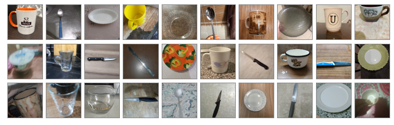
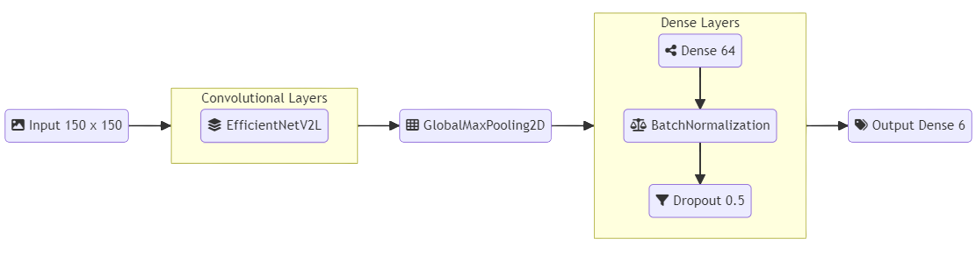

# Lost in Cupboard - An Image Recognition Data Science Project



The aim of this project is to classify pictures of household items into six categories. 

A pretrained CNN based on the EfficientNet V2 architecture and pretrained weights from Imagenet is used for transfer learning. Image augmentation is applied to create variations of the trainable dataset and increase generalizability. 

The used architecture is shown in the graph below:



The final model is deployed as prediction service to Kubernetes.


## Data

The data used for this project is taken from the [Kitchenware Classification Competition](https://www.kaggle.com/competitions/kitchenware-classification) at Kaggle.

The dataset has 9.367 images of kitchenware items. 60% of the images (5.560) are labeled.
The aim is to use image recognition to categorize unlabeld images of kitchenware items.


## Project Structure

Root folder:
* [`01-data-understanding.ipynb`](01-data-understanding.ipynb):
  Analyse the content of the images. Characterize similarities and differences between the classes and infer reasonable data augmentation options.
* [`02-model-training.ipynb`](02-model-training.ipynb):
  Train model and perform hyper-parameter tuning.
* `train.py`: Train final CNN architecture.

* `data/`: 
    * `images/`: Folder will be created when downloading the data.
    * `test_labeled.csv`: 200 labeled images for testing locally without submitting to Kaggle.
* `models/`: Folder for trained models. 
    * `train_history.csv`: Logging file for the performed training cycles.
* `deployment/`: Folder contains all configurations for the deplyoment.
    * [`README.md`](deployment/README.md): Step-by-step explanation for deploying the model.
* `src/`:  
    * `generate_dataset_preview.py`: Script which generates the cover image for this repository.
    * `kitchenware_helper.py`: Helper functions for training on and analysing the data.


## Getting Started

### Training
Training the model on a GPU is significatnly faster.

You could use Saturn Cloud to train the model on a GPU for free.

**Prerequisites:**
* Saturn Cloud account. If not [signup here](https://bit.ly/saturn-mlzoomcamp) for free.
* Kaggle account for downloading the data. If not [signup here](https://www.kaggle.com/account/login?phase=startRegisterTab).

[](https://app.community.saturnenterprise.io/dash/resources?recipeUrl=https://raw.githubusercontent.com/LoHertel/lost-in-cupboard/main/saturn-cloud-recipe.json)

After having clicked on the button above follow these steps:
1. Create jupyter workspace
2. Open tab "Secrets"
3. Edit the kaggle.json secret
4. Click "new secret"
5. Enter "kaggle.json" as name
6. Paste content from kaggle.json API file as value (see below how to download this API file)
7. Click "Save"
8. Go to tab "Overview" and clock "Start" to start the Jupyter Server

### Training Locally

> **Note**: These instructions are focused on unixoid shells. Please use either Unix, macOS or WSL on Windows.

**Prerequisites:**
* Have Python 3.9 and `pip` installed. Try to run `python3.9 --version` and `pip3 --version`.
* Have `git` installed. Try to run `git --version`.
* Kaggle account for downloading the data. If not [signup here](https://www.kaggle.com/account/login?phase=startRegisterTab).

**Install pipenv**  
Check if you have `pipenv` already:
```bash
pip list | grep pipenv
```

*If the output is empty, follow this section, otherwise go to the next section for cloning the repository.*

Install `pipenv` if you don't have it yet. This command can help you get started:
```bash
pip install --user pipenv
```
You could find more installation options for `pipenv` [here](https://pypi.org/project/pipenv/#installation).


**Clone Repository**  
```bash
git clone https://github.com/LoHertel/lost-in-cupboard.git
cd lost-in-cupboard/
```

Create environment:
```bash
pipenv install --dev
```

Activate environment:
```bash
pipenv shell
```


**Setup kaggle**  
Go to your [kaggle account](https://www.kaggle.com/me/account), scroll down to "API" and click "Create New API Token".  
A "kaggle.json" file gets downloaded. Move this file from you downloads folder into `~/.kaggle`.  

*When you are using WSL, you could run this command in bash to copy the file:*
```bash
mkdir -p ~/.kaggle/ 
cp /mnt/c/Users/<your Windows user>/Downloads/kaggle.json -t ~/.kaggle/ 
chmod 600 ~/.kaggle/kaggle.json
```

**Download Data**

> **Note**: You need a Kaggle account and API key for downloading the data. See above.

```bash
kaggle competitions download -c kitchenware-classification
mkdir data
unzip kitchenware-classification.zip -d data > /dev/null
rm kitchenware-classification.zip
```

**Perform training**

1. Read / run [data understanding notebook](01-data-understanding.ipynb)
2. Read / run [training notebook](02-model-training.ipynb)
3. Execute training of final model after hyperparameter tuning in notebook above: 
```bash
python train.py 10
```
> **Note:** `10` is the number of epochs, that the script should train. The number can be changed in the bash command above.

### Deployment

To deploy the prediction service to a Kubernetes cluster, please follow the [deployment instructions here](deployment/README.md).


##  Further Improvement

* Implement class specific data augmentation rules.
* Try more CNN architectures besides EfficientNetV2.


## Special Mentions
This is my capstone project I for the Machine Learning Zoomcamp 2022.

I'd like to thank the [DataTalks.Club](https://datatalks.club) and [Alexey Grigorev](https://github.com/alexeygrigorev) for hosting the Machine Learning Zoomcamp completely free. If you want to upskill on Machine Learning, please check out their self-paced [course](https://github.com/alexeygrigorev/mlbookcamp-code/tree/master/course-zoomcamp). :)